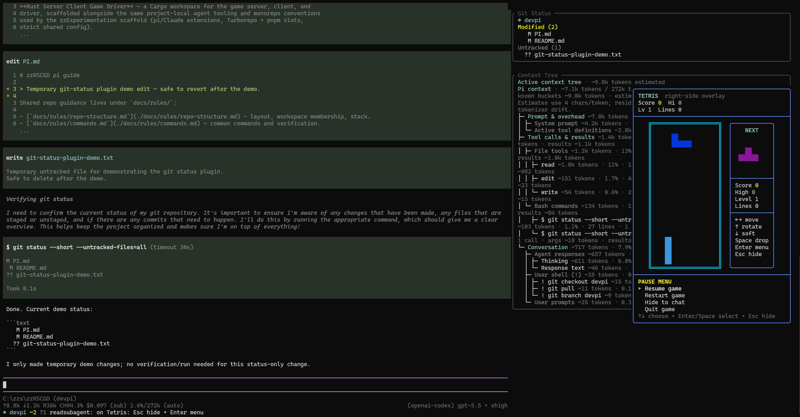
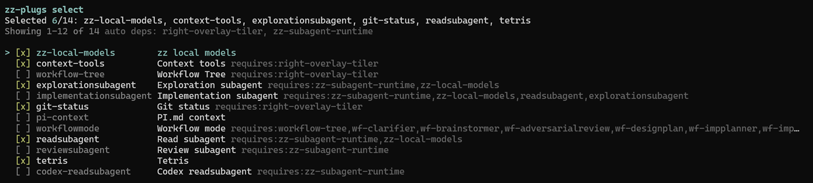
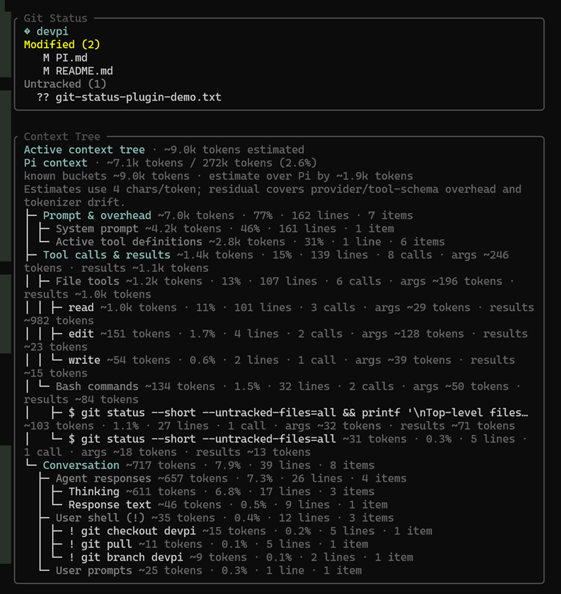
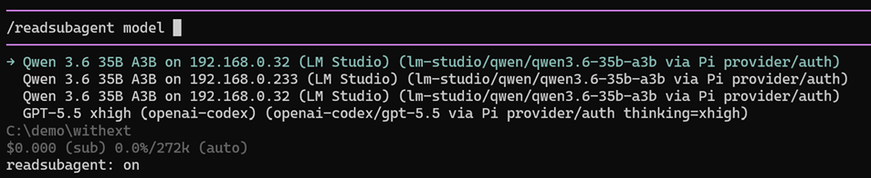

# zzPi

`zzPi` is a context-routing toolkit for coding agents.

Built on [Pi](https://pi.dev) — huge thanks to Pi's creator for making a flexible local agent harness that makes this kind of routing possible.

The goal is simple: **keep the main thread's context small and valuable**. Do not make the expensive/remote/main model explore every file, scan every directory, or carry raw repo noise forever. Send that work to local agents, then give the main model a compact map of what actually matters.

This shines when paired with capable local agents: local models handle scouting, repo archaeology, read planning, and other high-volume context work while the main model focuses on decisions and edits. That is not just a context-quality win; it also reduces the paid tokens spent on exploration and repeated raw-file reads.

This repository is generated from `zzHostWebsite`. Do not edit generated `pi-plugs/` or `zz-lib/` artifacts directly; regenerate the export from the source checkout instead.

> **Early-state note:** This repo is still early. Install commands for your own LM Studio setup are provided, but they are a WIP. Until the setup flow is stable, please ask your own model/harness to help fix any setup issues you hit.

## Core idea

Most coding-agent waste starts with reads:

1. The user asks a question.
2. The main model does broad discovery and reads too many files.
3. The main context fills with raw code, logs, docs, and dead ends.
4. The model has less room for the actual reasoning/editing work.

`zzPi` flips that flow:

1. The main model asks a local scout agent for a factual read plan.
2. The local agent explores the repo with cheap/local context.
3. It returns a concise map: relevant files, line ranges, symbols, search terms, related areas to avoid, and uncertainty.
4. The main model reads only the small, targeted slices it needs.

The current system is built around focused repository inspection (`readsubagent`) plus standalone brainstorming, design, implementation, debugging, and adversarial-vetting agents. The parent agent dynamically composes only the callable stages a task needs, while prompt enrichment remains an explicit user-triggered step. The broader design is **token/context flow control**: decide which work belongs in the main thread and which work should be delegated.

<figure>
     
 </figure>

<figure>
  <figcaption>Built in Extension manager</figcaption>
  
 </figure>

<figure>
  <figcaption>Context Tree and Git Tree, know what is going on</figcaption>
  
 </figure>

<figure>
  <figcaption>Granular model provider setup per subagent</figcaption>
  
 </figure>

## Why Pi is the runner

Pi is flexible enough to act as a local, harness-agnostic subagent runner:

- It can spawn child Pi processes on local LM Studio/OpenAI-compatible models.
- Project-local extensions can register tools and commands directly.
- Subagents can each choose their own provider/model/endpoint.
- Some agents can stay local while others use remote providers.
- Config lives in the repo under `.pi/`, so each project can tune its own routing.

In Pi itself this is first-class: `/readsubagent`, `/debuggersubagent`, `/design-loop`, `/implementation-mode`, prompt enrichment, vetting agents, and `/zz-model-setup` can route work to local or remote models with fine-grained control.

For closed or harder-to-customize harnesses, `zzPi` exposes the same idea in a reduced form:

- **Codex** gets a repo-local custom readsubagent and provider setup.
- **Claude Code** gets a subagent plus a stdio MCP server that calls Pi.
- **Copilot / VS Code** gets a workspace MCP server plus instructions.
- Any MCP-capable harness can use the standalone `zz-readsubagent-mcp` server.

Those integrations cannot match Pi's full extension/runtime control, but they still let the main harness ask a local Pi-backed scout for a compact read plan instead of spending main context on exploration.

## What you install

The public export contains two layers:

1. **Pi plugs** — project-local `.pi/` extensions installed by `install.sh`.
2. **Harness integrations** — Codex/Claude/Copilot/MCP readsubagent installers, also selectable from Pi's `/zz-plugs select` UI.

The separate `zz-refs` bundle is intentionally not included in this public export.

The important user-facing commands are:

- `/zz-plugs select` — choose Pi plugs and harness readsubagent integrations.
- `/zz-model-setup setup` — point local-model configs at your LM Studio/OpenAI-compatible endpoint.
- `/readsubagent ask ...` — ask a local read-only file-inspection agent for a focused answer/map.
- `/debuggersubagent ask ...` — delegate read-only root-cause diagnosis.
- `/design-loop` — enable or inspect the standalone brainstorm/design workflow.
- `/implementation-mode` — toggle parent-directed delegation of bounded implementation pieces.

## Why workflow mode was retired

When explicitly enabled, the original workflow mode intercepted the next normal prompt and ran it through one fixed, stateful pipeline. That was useful before the individual agents were mature, but it became redundant once the standalone agents were tuned and the parent agent could orchestrate them directly.

The standalone stack now supersedes the old mode:

- `readsubagent` gathers focused repository context when the parent needs it.
- `promptenrichsubagent` provides optional user-triggered clarification through `/pe` or `Alt+E`; the parent does not invoke it automatically.
- `brainstormer`, `designplanner`, and `design-loop` handle explicit solution exploration and design.
- `implementationsubagent` executes parent-decomposed, bounded implementation work.
- `debuggersubagent` performs focused root-cause analysis.
- `vettingagents` provides independent adversarial review when the change warrants it.

This dynamic approach avoids mandatory stages, duplicate context, and fixed review loops. Each agent remains independently configurable, while the parent retains control of sequencing, integration, verification, and git operations.

On a managed upgrade through `/zz-plugs update` or `install.sh`, the plug manager removes the retired workflow runtime and agent files. Former `workflow-tree.config.jsonc` and `wf-*.config.jsonc` files are preserved intentionally in case they contain local customization; they can be deleted manually after updating. Legacy `.zzwf/workflows/` and `.zzwf/tmp/` artifacts are also left for manual cleanup.

## Install Pi plugs

From a cloned checkout of this repo:

```bash
./install.sh --select
```

From the public raw URL:

```bash
curl -fsSL https://raw.githubusercontent.com/dezverev/zzPi/main/install.sh | bash -s -- --select
```

Useful options:

```bash
./install.sh --list
./install.sh --all
./install.sh --plugins git-status,readsubagent,design-loop
./install.sh --dry-run --select
```

The installer writes project-local files under `./.pi/` in the directory where you run it.

After install, start `pi` in that repo and use:

```text
/zz-plugs select
```

The checklist includes normal Pi plugs plus:

- `codex-readsubagent`
- `claude-readsubagent`
- `copilot-readsubagent`

Selecting those installs/removes the matching harness integration from the same UI.

## Configure your local model endpoint

Public exports default local endpoints to localhost. To use your own LM Studio or OpenAI-compatible server, start Pi in the target repo and run:

```text
/zz-model-setup setup
```

Non-interactive form:

```text
/zz-model-setup set http://<your-lmstudio-host>:1234 qwen/qwen3.6-35b-a3b lm-studio
/reload
```

This updates the repo-local provider, endpoint selector, and installed child-agent configs so the local agents use your endpoint/model.

## Example local inference boxes

These are rough observed baselines for the local-agent side of the setup. They are not requirements; they are examples of how different boxes can be used to keep read/discovery work off the main model:

| Box | Suggested role | Observed setup |
|---|---|---|
| M5 Max, 128 GB | High-end local agent host | Can run Qwen 3.6 27B 8-bit for coding plus Qwen 3.6 35B A3B 4-bit for reads. Full ~267k context for both. A3B reads around 120 tok/s. |
| Dual RTX 5060 Ti | Fast local read/discovery host | Qwen 3.6 35B A3B 4-bit at 127k context around 80 tok/s. Higher context works less well / falls off. |

The practical takeaway: use the largest context that is actually fast on the box. For example, a desktop GPU box may be better at 127k while an Apple Silicon machine with enough unified memory may be comfortable at full context.

## Standalone harness installers

You can install harness integrations directly too. Run these from the target repo root.

Codex MCP tool + custom agent + user-level LM Studio provider:

```bash
curl -fsSL https://raw.githubusercontent.com/dezverev/zzPi/main/install-codex-readsubagent.sh | bash
```
```powershell
irm https://raw.githubusercontent.com/dezverev/zzPi/main/install-codex-readsubagent.ps1 | iex
```

Claude Code subagent + stdio MCP server:

```bash
curl -fsSL https://raw.githubusercontent.com/dezverev/zzPi/main/install-claude-readsubagent.sh | bash
```
```powershell
irm https://raw.githubusercontent.com/dezverev/zzPi/main/install-claude-readsubagent.ps1 | iex
```

Copilot / VS Code workspace MCP server + instructions:

```bash
curl -fsSL https://raw.githubusercontent.com/dezverev/zzPi/main/install-copilot-readsubagent.sh | bash
```
```powershell
irm https://raw.githubusercontent.com/dezverev/zzPi/main/install-copilot-readsubagent.ps1 | iex
```

MCP server only, for any MCP-capable harness:

```bash
curl -fsSL https://raw.githubusercontent.com/dezverev/zzPi/main/install-zz-readsubagent-mcp.sh | bash
```

Codex/Claude/Copilot/MCP integrations require `pi` on PATH with a usable local-model provider and a reachable local OpenAI-compatible server. Install `zz-local-models` through Pi plugs or define your own Pi provider.

## Repository layout

- `install.sh` — public Pi plug installer.
- `pi-plugs/manifest.json` — generated plugin manifest.
- `pi-plugs/pi-plugs.tar.gz` — generated plugin archive consumed by the installer.
- `pi-plugs/files/` — exported source files used to build the archive.
- `zz-lib/manifest.json` — generated shared runtime manifest.
- `zz-lib/pi-plugs.tar.gz` — generated shared runtime archive.
- `zz-lib/files/` — exported shared runtime source files.
- `pi-plugs/files/README.md` — exported plugin catalog documentation.
- `install-codex-readsubagent.{sh,ps1}` + `codex-readsubagent/readsubagent.toml` — Codex readsubagent installer, agent, `.codex/config.toml` MCP registration, and `.zz-mcp/` server.
- `install-claude-readsubagent.{sh,ps1}` + `claude-readsubagent/readsubagent.md` — Claude Code readsubagent installer + subagent.
- `install-copilot-readsubagent.{sh,ps1}` — Copilot/VS Code readsubagent installer + workspace MCP instructions.
- `install-zz-readsubagent-mcp.{sh,ps1}` + `zz-readsubagent-mcp/` — harness-neutral readsubagent MCP server.

## Related docs

- [Plugin source README](pi-plugs/files/README.md)
